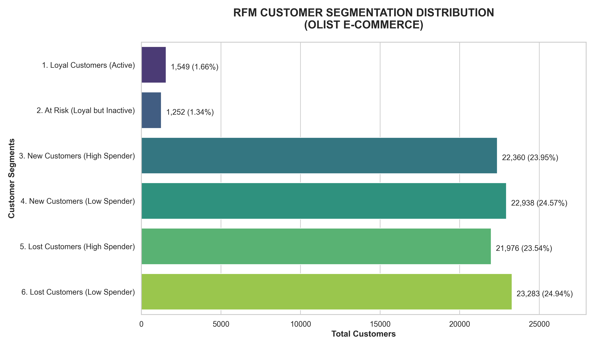
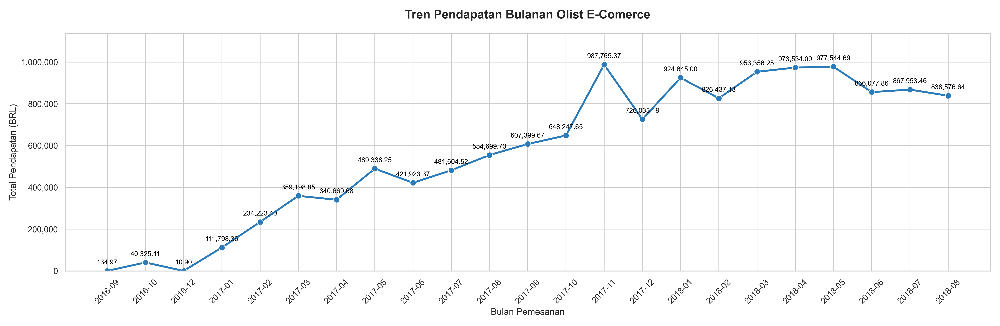
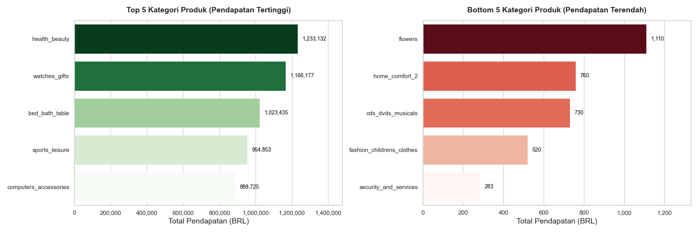
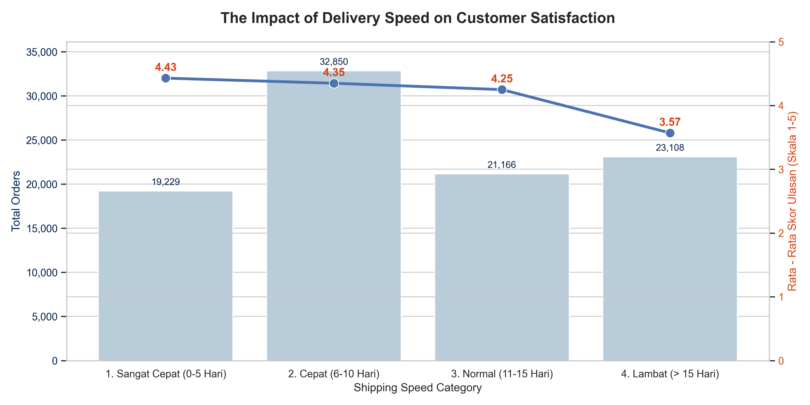

# Olist Store E-Commerce Business Performance & RFM Analysis

📊 **[KLIK DI SINI UNTUK MELIHAT INTERACTIVE DASHBOARD LOOKER STUDIO]**([MASUKKAN_LINK_LOOKER_STUDIO_DI_SINI])

> 💡 **Tip:** Anda dapat menggunakan dashboard ini sebagai _template_ untuk data Olist Anda sendiri. Buka tautan di atas, klik ikon tiga titik di pojok kanan atas, pilih **'Make a copy' (Buat salinan)**, dan hubungkan dengan dataset CSV Anda!

## 📌 Project Overview

Proyek ini merupakan simulasi pekerjaan Data Analyst secara _end-to-end_ untuk menganalisis kumpulan data riil dari **Olist**, perusahaan e-commerce terbesar di Brazil. Proyek ini berfokus pada ekstraksi data menggunakan **PostgreSQL**, pemrosesan pemodelan segmentasi pelanggan menggunakan **Python**, dan diakhiri dengan pembuatan _Executive Dashboard_ interaktif menggunakan **Google Looker Studio**.

## 🎯 Business Problems Solved

1. **Customer Retention (RFM):** Bagaimana karakteristik pelanggan Olist berdasarkan metode _Recency, Frequency, Monetary_?
2. **Revenue Trend:** Bagaimana tren volume pesanan dan pendapatan perusahaan dari bulan ke bulan?
3. **Product Performance:** Kategori produk apa yang menyumbang pendapatan tertinggi (_Top 5_) dan terendah (_Bottom 5_)?
4. **Logistics & Satisfaction:** Apakah ada korelasi antara lamanya waktu pengiriman (_delivery time_) dengan tingkat kepuasan pelanggan (_review score_)?

## 🛠️ Tech Stack & Tools

- **Relational Database:** PostgreSQL (pgAdmin 4) - _Data Quality Check, Multiple JOINs, CTEs, Aggregation._
- **Programming Language:** Python 3 - _Data manipulation, logic mapping, & persentil calculation (qcut)._
- **Libraries:** Pandas, NumPy, Matplotlib, Seaborn.
- **Business Intelligence:** Google Looker Studio - _Interactive Dashboard, Calculated Fields (Data Cleansing), Custom SQL Logic (CASE WHEN), Dual-Axis Combo Charts._
- **IDE:** Visual Studio Code (Jupyter Notebooks).

---

## 💡 Key Insights & Strategic Recommendations

### 1. Customer Retention (RFM Analysis)

- **Krisis Retensi Pelanggan:** Mayoritas mutlak pelanggan (**~97%**) adalah pembeli satu kali (_one-time buyers_).
- **Pelanggan Loyal Sangat Langka:** Hanya sekitar **3%** (2.801 orang) yang pernah melakukan pembelian kedua atau lebih.
- **Rekomendasi Tindakan (Actionable Insight):** Tim Marketing Olist direkomendasikan untuk tidak hanya berfokus membakar uang pada akuisisi pelanggan baru, melainkan segera meluncurkan kampanye _Customer Retention_ (seperti diskon pembelian kedua, program loyalitas poin, atau _email marketing_ bertarget) kepada ~45.000 pelanggan di segmen _New Customers_ agar mereka mau bertransaksi kembali.

### 2. Revenue Trend & Seasonality

- **Puncak Pendapatan (Peak Season):** Terjadi lonjakan pendapatan yang sangat signifikan pada bulan **November 2017** (mencapai hampir 1 Juta BRL). Hal ini sangat berkorelasi dengan momentum **Black Friday**, yang merupakan event diskon e-commerce terbesar.
- **Rekomendasi Tindakan:** Tim Marketing dan Operasional harus mengalokasikan _budget_ promosi maksimal pada kuartal ke-4 (Q4), khususnya November, serta memastikan server aplikasi dan stok barang mitra penjual siap menghadapi lonjakan _traffic_ tahunan tersebut.

### 3. Product Performance (Top & Bottom Categories)

- **Kategori Unggulan:** `Health Beauty`, `Watches Gifts`, dan `Bed Bath Table` adalah tiga pilar utama penyumbang pendapatan terbesar bagi platform Olist.
- **Kategori Kurang Peminat:** Produk seperti `Security and Services` dan `Fashion Childrens Clothes` memiliki performa penjualan yang sangat rendah.
- **Rekomendasi Tindakan:** Fokuskan algoritma rekomendasi halaman depan aplikasi pada produk _Top 3_. Untuk kategori _Bottom 5_, manajemen perlu mengevaluasi apakah kategori tersebut perlu dipertahankan atau dihapus (_delisting_) agar fokus perusahaan tidak terpecah.

### 4. Delivery vs Customer Satisfaction

- **Dampak Fatal Keterlambatan:** Terdapat korelasi negatif yang sangat tajam; semakin lama waktu pengiriman, semakin hancur tingkat kepuasan pelanggan. Pengiriman yang memakan waktu **di atas 15 hari** membuat rata-rata skor ulasan (_review score_) anjlok drastis ke angka **3.57**.
- **Rekomendasi Tindakan:** Kepuasan di bawah bintang 4 akan merusak reputasi Olist di mata calon pembeli baru. Tim Logistik wajib melakukan audit terhadap mitra ekspedisi yang menangani rute lambat ini, memberikan penalti keterlambatan, atau mencari mitra logistik baru yang lebih menjamin SLA (_Service Level Agreement_).

---

## 📂 Repository Structure

- **`dashboards/`**: Berisi visualisasi data, termasuk grafik statis resolusi tinggi (PNG) hasil EDA Python dan file laporan (PDF) dari Looker Studio.
- **`data/processed/`**: Berisi file CSV (_clean data_) hasil ekstraksi SQL yang siap dianalisis. _(Catatan: Data mentah tidak diunggah karena batasan ukuran file)._
- **`sql_queries/`**: Kumpulan skrip PostgreSQL untuk menjawab _Business Questions_.
- **`notebooks/`**: File Jupyter Notebook (`.ipynb`) yang berisi pemrosesan data EDA, penentuan batas segmentasi RFM, dan _data wrangling_ menggunakan Python.

> **Note:** Dataset mentah dapat diunduh langsung dari [Kaggle - Brazilian E-Commerce Public Dataset by Olist](https://www.kaggle.com/datasets/olistbr/brazilian-ecommerce).
