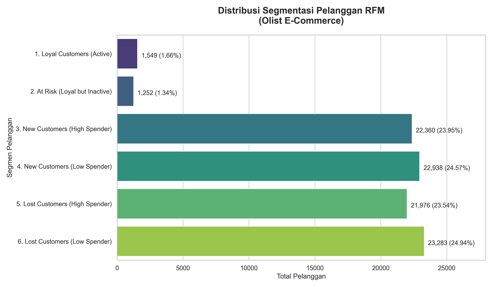

# Olist E-Commerce Business Performance & RFM Analysis 🛒📊

## 📌 Project Overview

Proyek ini merupakan simulasi pekerjaan Data Analyst secara _end-to-end_ untuk menganalisis kumpulan data riil dari **Olist**, perusahaan e-commerce terbesar di Brazil. Proyek ini berfokus pada ekstraksi data menggunakan **PostgreSQL** dan pemodelan segmentasi pelanggan menggunakan metode RFM di **Python**.

## 🎯 Business Problems Solved

1. **Revenue Trend:** Bagaimana tren volume pesanan dan pendapatan perusahaan dari bulan ke bulan?
2. **Product Performance:** Kategori produk apa yang menyumbang pendapatan tertinggi (_Top 5_) dan terendah (_Bottom 5_)?
3. **Logistics & Satisfaction:** Apakah ada korelasi antara lamanya waktu pengiriman (_delivery time_) dengan tingkat kepuasan pelanggan (_review score_)?
4. **Customer Retention (RFM):** Bagaimana karakteristik pelanggan Olist berdasarkan metode _Recency, Frequency, Monetary_?

## 🛠️ Tech Stack & Tools

- **Relational Database:** PostgreSQL (pgAdmin 4) - _Data Quality Check, Multiple JOINs, CTEs, Aggregation._
- **Programming Language:** Python 3 - _Data manipulation & logic mapping._
- **Libraries:** Pandas, NumPy, Matplotlib, Seaborn.
- **IDE:** Visual Studio Code (Jupyter Notebooks).

## 💡 Key Insights & Strategic Recommendations

Berdasarkan analisis segmentasi RFM terhadap **93.358 pelanggan unik**, ditemukan _insight_ bisnis yang krusial:

- **Krisis Retensi Pelanggan:** Mayoritas mutlak pelanggan (**~97%**) adalah pembeli satu kali (_one-time buyers_).
- **Pelanggan Loyal Sangat Langka:** Hanya sekitar **3%** (2.801 orang) yang pernah melakukan pembelian kedua atau lebih.
- **Rekomendasi Tindakan (Actionable Insight):** Tim Marketing Olist direkomendasikan untuk tidak hanya berfokus membakar uang pada akuisisi pelanggan baru, melainkan segera meluncurkan kampanye _Customer Retention_ (seperti diskon pembelian kedua, program loyalitas poin, atau _email marketing_ bertarget) kepada ~45.000 pelanggan di segmen _New Customers_ agar mereka mau bertransaksi kembali.

## 📂 Repository Structure

- **`data/processed/`**: Berisi file CSV hasil ekstraksi SQL dan grafik visual. _(Catatan: Data mentah tidak diunggah karena batasan ukuran file)._
- **`sql_queries/`**: Kumpulan skrip PostgreSQL untuk menjawab _Business Questions_.
- **`notebooks/`**: File Jupyter Notebook (`.ipynb`) yang berisi pemrosesan data RFM dan visualisasi menggunakan Python.

> **Note:** Dataset mentah dapat diunduh langsung dari [Kaggle - Brazilian E-Commerce Public Dataset by Olist](https://www.kaggle.com/datasets/olistbr/brazilian-ecommerce).
